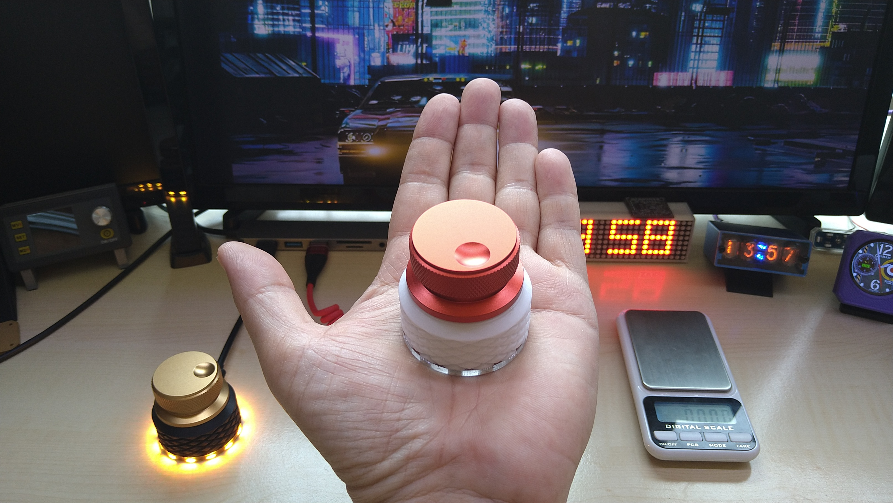
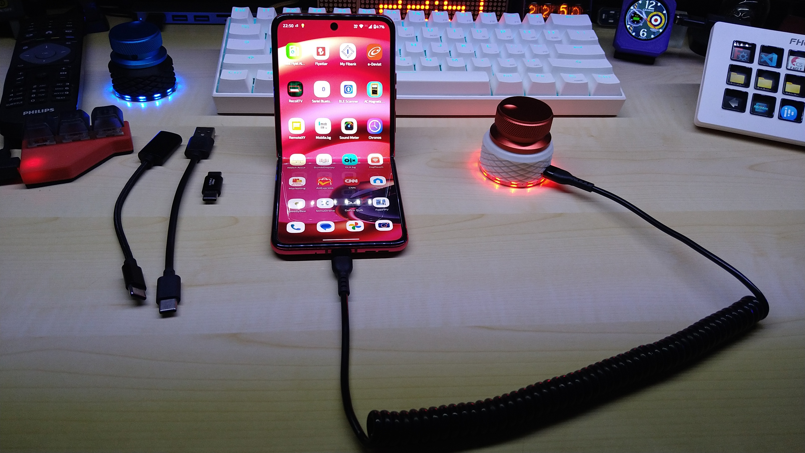

# MagScroll – The Future of Scrolling, Zooming & Volume Control

<!-- Product Images -->

  
  
  

MagScroll is a precision magnetic scroll controller designed to give you a smoother, more intuitive way to interact with your computer.  
This repository contains the companion app, firmware files, and resources for users who backed the first Kickstarter campaign — and for everyone discovering MagScroll now.

---

## 🎉 Thank You to All Backers

A huge thank you to all my backers on Kickstarter who made the MagScroll a success.  
Your support turned this idea into a real product, and I’m incredibly grateful.

Please tell your family, friends, and colleagues about MagScroll — I’m planning a **second campaign in the near future**, and your help spreading the word makes a big difference.

---

## 📘 User Manual (PDF)

You can download the MagScroll user manual here:

👉 **[MagScroll_Manual.pdf](MagScroll_Manual.pdf)**

---

## 📥 Companion App (Windows)

If you're using the MagScroll companion app:

- **Try v2 first**  
- If you experience any issues, **try v5**

The more detailed information you can give me about any problems, the better I can troubleshoot and improve the app.

---

## 🚀 Kickstarter Campaign

Here is the link to the first Kickstarter campaign that launched MagScroll:

👉 https://www.kickstarter.com/projects/ihayri1/magscroll-the-future-of-scrolling-zooming-or-volume-control

---

## 📂 Repository Contents

- **MagScrollAppV2** – Recommended first version of the companion app  
- **MagScrollAppV5** – Alternative version if you encounter issues  
- **Firmware files** – For updating your MagScroll device  
- **Documentation** – Setup instructions and usage notes  
- **MagScroll_Manual.pdf** – User manual  

---

## 🛠 Feedback & Support

If you encounter bugs, have suggestions, or want to share your experience, please open an Issue here on GitHub or contact me directly.  
Your feedback helps shape the next generation of MagScroll.

---

## 🌟 Stay Tuned

More updates, improvements, and the **second Kickstarter campaign** are coming soon.  
Thank you again for being part of this journey!
