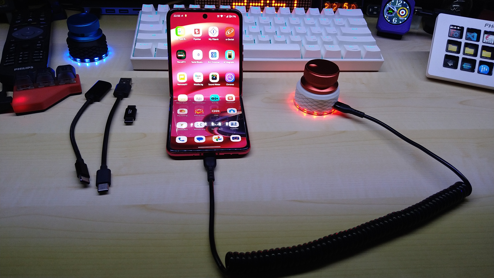

# MagScroll™ – Smooth, Precise Computer Control

<!-- Product Images -->

  
  
  

MagScroll™ is a precision magnetic control knob designed to give you a smoother, more intuitive way to interact with your computer.

This repository contains the MagScroll™ companion app, firmware files, documentation, and other resources for existing MagScroll™ owners and for everyone discovering MagScroll™ now.

---

## 🚀 Current Kickstarter Campaign

MagScroll™ is back on Kickstarter.

👉 **[MagScroll™ — Smooth, Precise Computer Control](https://www.kickstarter.com/projects/ihayri1/magscroll-smooth-precise-computer-control)**

The project has been approved and is now available as a pre-launch campaign.

---

## The Newest Function: VFD Spindle Speed Control

Control your spindle speed, including turning it ON and OFF.

You can see it in this video:

https://youtu.be/Pd_zzcSXB4o

---

## 🎉 Thank You to All Backers

A huge thank you to all my backers on Kickstarter who helped make MagScroll™ a real product.

Your support turned this idea into a manufactured product that has already been delivered to backers around the world. I’m incredibly grateful.

The current Kickstarter campaign is funding the next production run of MagScroll™.

---

## 📘 User Manual (PDF)

You can find the MagScroll™ user manual here:

👉 **[MagScroll User Manual](MagScroll_User_Manual.pdf)**

---

## 🔔 Firmware Update Notice

To ensure you always have access to the latest firmware, please note the following:

* The **Firmware** folder in this GitHub repository will always contain the **most up-to-date firmware files** for MagScroll™.
* The firmware included inside the **zipped companion app downloads** may be **older versions** and are kept only for compatibility.

For the newest features, improvements, and bug fixes, always use the firmware from this GitHub repository.

---

## 📥 Companion App (Windows)

The MagScroll™ companion app allows you to configure and customize your MagScroll™, including switching between different control functions.

Available versions:

* **MagScrollFixedV2.zip** – Recommended first version
* **MagScrollAppV5.zip** – Alternative version if you encounter issues
* **MagScrollTest.zip** – Test version

The repository also contains the firmware and supporting files required by the different app versions.

If you encounter any problems, the more detailed information you can provide, the better I can troubleshoot and improve the app.

---

## 📂 Repository Contents

* **MagScrollFixedV2.zip** – Recommended first version of the companion app
* **MagScrollAppV5.zip** – Alternative version if you encounter issues
* **MagScrollTest.zip** – Test version of the companion app
* **Firmware** – Firmware files for updating your MagScroll™ device
* **Documentation** – Setup instructions and usage notes
* **MagScroll_User_Manual.pdf** – User manual

---

## 🛠 Feedback & Support

If you encounter bugs, have suggestions, or want to share your experience, please open an Issue here on GitHub or contact me directly.

Your feedback helps improve MagScroll™.

---

## 🌟 MagScroll™ on Kickstarter

Follow the current Kickstarter campaign for launch updates and information about the next production run:

👉 **[MagScroll™ — Smooth, Precise Computer Control](https://www.kickstarter.com/projects/ihayri1/magscroll-smooth-precise-computer-control)**

Thank you for being part of the MagScroll™ journey!
